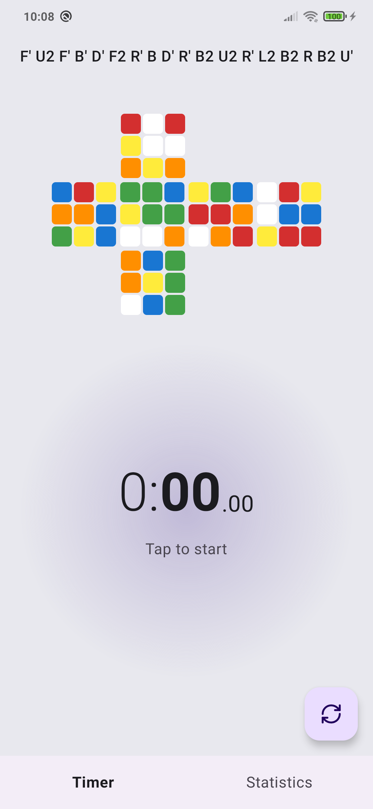
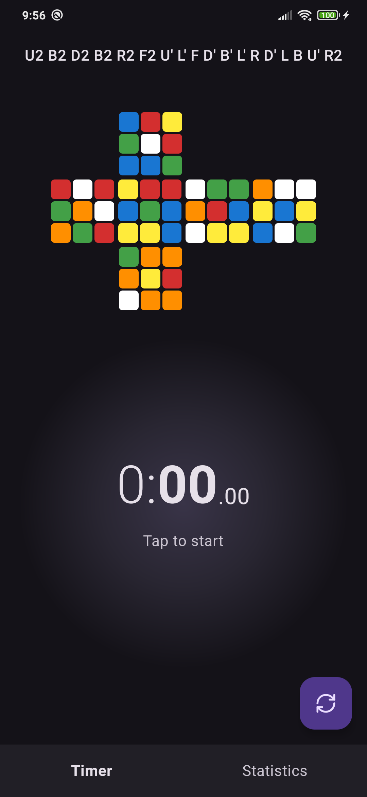
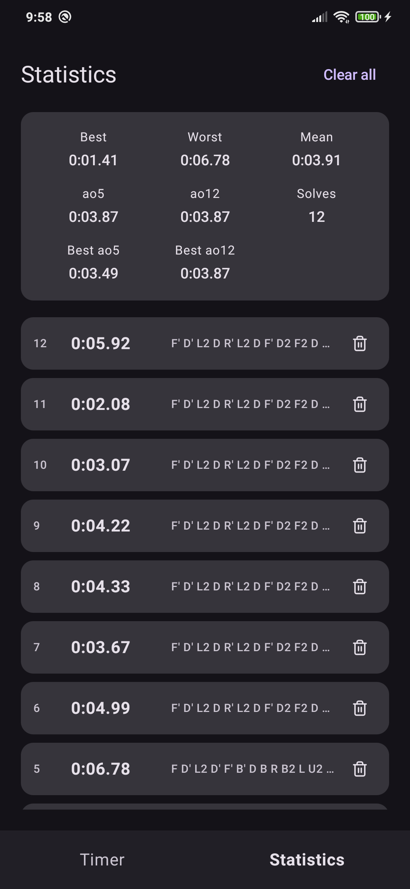
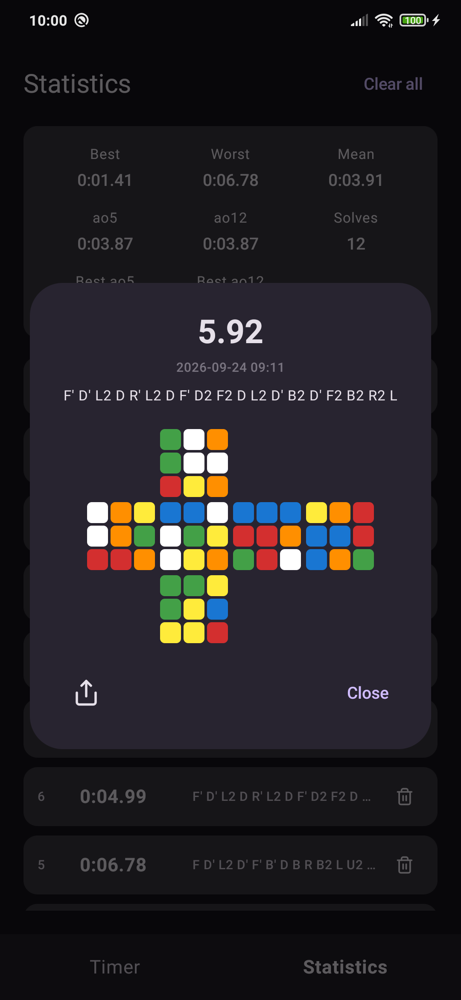

<p align="center">
  
</p>

# CubeTimer

An offline 3×3 speedcubing timer for Android. CubeTimer keeps the essentials in one focused app: random-state scrambles, a live cube map, a tap-to-start timer, statistics, local history, and shareable solve cards.

No account. No ads. No telemetry. No Internet permission.

[Source code](https://github.com/danilolutz/cubetimer) · [Report a bug](https://github.com/danilolutz/cubetimer/issues/new/choose) · [Releases](https://github.com/danilolutz/cubetimer/releases)

## Screenshots

<p align="center">
  
  
  
  
</p>

## Features

- Offline random-state 3×3 scrambles generated by a local port of TNoodle-lib 0.19.2.
- A cube map that reflects the current scramble.
- Tap the timer area to start and stop; the scramble remains visible until you request the next one.
- Local history of up to 200 solves, with single-solve deletion, undo, and clear-all confirmation.
- Best, worst, mean, current ao5/ao12, and best ao5/ao12 statistics.
- Solve detail card with scramble, cube map, completion time, and PNG sharing.
- Light and dark themes, including readable feedback messages in both.

## Privacy and data

CubeTimer is designed to work without a network connection. It declares no Internet permission and contains no analytics, advertising SDK, account, or remote service integration.

Solves are stored only on the device in `SharedPreferences`. A PNG is prepared for the Android share sheet only after you explicitly select the share action. The app uses a `FileProvider` solely to grant temporary access to that requested file.

### Upgrade note

The first launch of this architecture deliberately removes the legacy history key once and starts with an empty history. Subsequent solves use the current local format and remain capped at 200 entries.

## Build and test

Requirements:

- Android Studio or JDK 17+
- Android SDK Platform 37
- A connected device or emulator for instrumentation tests

On macOS or Linux:

```sh
./gradlew testDebugUnitTest
./gradlew connectedDebugAndroidTest
./gradlew lint
./gradlew assembleDebug
./gradlew assembleRelease
```

On Windows PowerShell:

```powershell
.\gradlew.bat testDebugUnitTest
.\gradlew.bat connectedDebugAndroidTest
.\gradlew.bat lint
.\gradlew.bat assembleDebug
.\gradlew.bat assembleRelease
```

`assembleRelease` produces the release artifact from source. Distribution signing is intentionally left to the release channel; F-Droid signs the builds it publishes.

## Architecture

The code favors small objects, constructor injection, and direct dependencies over framework-driven abstractions:

```text
domain/   cube model, solves, timer session/state, pure statistics
data/     SharedPreferences history and Android PNG sharing
feature/  timer state holder, history, and solve sharing flows
ui/       Compose screens, cube map, formatting, and theme
```

`TimerViewModel` exposes one `StateFlow<TimerUiState>` for UI state. The only boundary contracts are `SolveRepository`, `ScrambleSource`, and `SolveImageSharer`; their Android implementations are injected by the activity.

The vendored `cs/min2phase` source is deliberately isolated and unchanged. `TnoodleThreeByThreeScrambler` is the adapter between that third-party generator and CubeTimer's `ScrambleSource` contract.

## F-Droid status

The repository includes source-controlled store text, icon, screenshots, and a changelog under `fastlane/metadata/android/en-US/`. This follows the Fastlane layout supported by F-Droid for app metadata and graphics.

CubeTimer is not listed on F-Droid yet. Submission requires a public source repository and a tagged release; only then can an external `fdroiddata` entry safely declare the [repository URL](https://github.com/danilolutz/cubetimer), release commit, version name, and version code. See the [F-Droid metadata guide](https://f-droid.org/docs/Build_Metadata_Reference/) and the [graphics and screenshots guide](https://f-droid.org/docs/All_About_Descriptions_Graphics_and_Screenshots/).

## Contributing

Contributions are welcome. Read [CONTRIBUTING.md](CONTRIBUTING.md) before opening a pull request. Report security vulnerabilities privately as described in [SECURITY.md](SECURITY.md), and follow the [Code of Conduct](CODE_OF_CONDUCT.md) in all project spaces.

## License and attribution

CubeTimer is licensed under the [GNU General Public License v3.0 or later](LICENSE).

Its 3×3 scramble generator includes a local adapted port of [TNoodle-lib](https://github.com/thewca/tnoodle-lib) `v0.19.2`. TNoodle is the official WCA scramble program. The imported `min2phase` notices and the full attribution are in [NOTICE](NOTICE).
